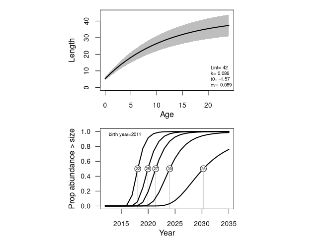
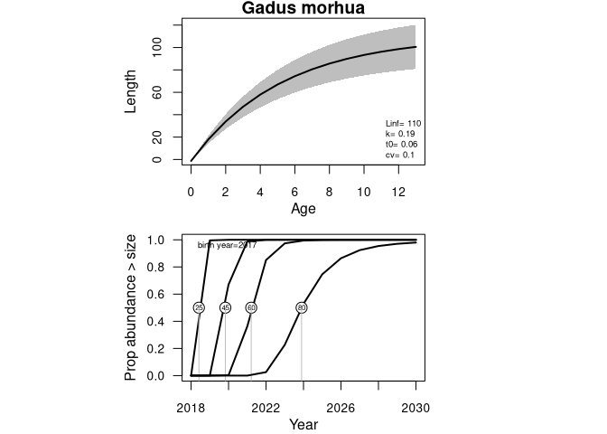
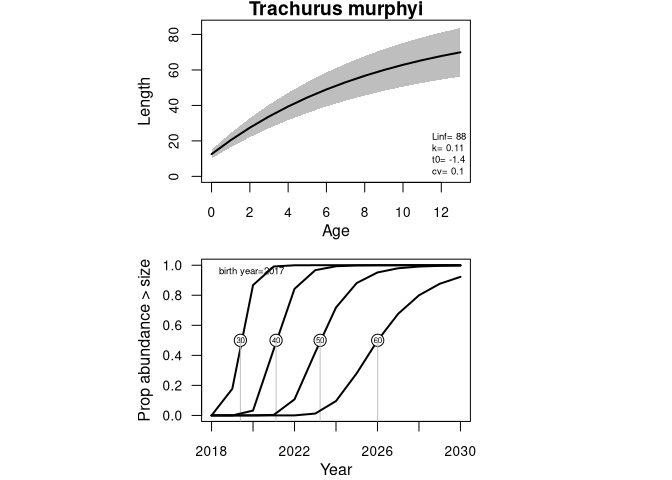

Time of recruitment to different sizes
--------------------------------------

Based on von Bertalanffy growth parameters given to the function, the CV
around length at age and the year of birth, this determines the
proporption of a year class’s individuals that are at or above a certain
specified length in each year. This is plotted as cumulative
distribution functions. It assumes normally distributed lengths for an
age based on the cv supplied. There are assumptions about mortality
inherent in this, namely that mortality is not size based.

It is a broad method that will provide an idea of the year when the
majority of individuals in a cohort will reach a certain size.

Install the package
-------------------

    devtools::install_github("duplisea/vbrecruit")
    library(vbrecruit)

Calculate the curves based on Unit 1+2 redfish (Sebastes spp.)
--------------------------------------------------------------

    recruit= vbrecruit.f(birth.year=2011, final.year = 2035, Linf = 42, k = 0.086, t0 = -1.57, 
      cv = 0.089, lengths.of.interest=c(22,25,27,30,35))

The top figure shows the Von Bertalanffy growth curve give the
parameters supplied. The bottom figure shows the cumlative probability
distributions for each size. So if a curve is identified by the number
in the circle “25”, the way you read this is by seeing what propoportion
of a cohort from your specified birth year will be greater than or equal
to 25cm in each year. The 50% values are highlighted for each of your
lengths of interest. That is, the 50% mark shows when half of your
individuals in the cohort will at or above that size.

The growth parameters used for Sebastes here are based on fitting median
length at age for the 1980 cohort of Sebastes mentella from the survey
data. There are not stock specific growth parameters for all species. In
such cases it can be good to use estimates from fishbase. This is easy
using hte rfishbase package.

Use rfishbase to get VB parameters for all sorts of species from fishbase
-------------------------------------------------------------------------

    devtools::install_github("ropensci/rfishbase")
    library("rfishbase")

Now query fishbase and make some plots for Atlantic cod. This averages
over all the VB parameters for cod in fishbase so we call it a generic
stock.

    fish= "Gadus morhua"
    vb.params= matrix(as.numeric(as.matrix(popgrowth(fish,fields=c("TLinfinity","K","to")))),ncol=3)
    vb.mean= apply(vb.params,2,mean,na.rm=T)

Make plots for a generic cod stock for say a 2017 year class and length
of 25cm (recuit index), 45cm (size at recruitment, 60cm (when they start
to get valuable, 80cm (when they are very valuable)

    cod= vbrecruit.f(birth.year= 2017, final.year= 2030, Linf= round(vb.mean[1],0), k= round(vb.mean[2],2), t0= round(vb.mean[3],2), 
      cv= 0.1, lengths.of.interest=c(25,45,60,80))
    title(fish,outer=T,line=-0.75)

    fish= "Trachurus murphyi"
    vb.params= matrix(as.numeric(as.matrix(popgrowth(fish,fields=c("TLinfinity","K","to")))),ncol=3)
    vb.mean= apply(vb.params,2,mean,na.rm=T)

Make plots for a Chilean mackerel, Trachurus murphyi, stock for say a
2017 year class and lengths of 30cm, 40cm, 50, cm and 60cm.

    cod= vbrecruit.f(birth.year= 2017, final.year= 2030, Linf= round(vb.mean[1],0), k= round(vb.mean[2],2), t0= round(vb.mean[3],2), 
      cv= 0.1, lengths.of.interest=c(30, 40, 50, 60))
    title(fish,outer=T,line=-0.75)

